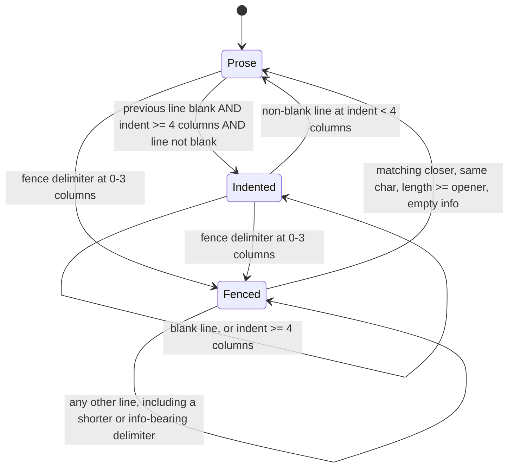

# Fence-Aware Scanner and Attribute-List Parser - Plan

## Goal Capsule

**Objective:** Ship Phase 1 Tasks 2 and 3 — `src/markua/scanner.lua`, which classifies every line as Markua or code, and `src/markua/attributes.lua`, which parses `{...}` attribute lists. Together they complete Phase 1: Foundation.

**Authority hierarchy:** `docs/plan.md` Tasks 2 and 3 are the authoritative specification (per `AGENTS.md`) and already carry a reference implementation for both modules. This plan governs execution order and three corrections to that reference implementation — KTD1, KTD4, and KTD8 — each found by running the shipped code rather than by reading it. KTD1 and KTD4 are confirmed against pandoc 3.10.1's own parse; KTD8 by executing the reference module and observing the value it drops. Two further decisions change no behavior: KTD3 and KTD5 pin what the reference already does so a later reader does not undo it. KTD2 is neither — it is a proactive boundary decision with no observed failure behind it, and it is labeled as one. Where this plan and `docs/plan.md` disagree, this plan wins for this increment, and U5 folds the corrections back so `docs/plan.md` stops shipping the superseded source.

**Execution profile:** Test-driven, following the Task 1 precedent. Each spec is written and observed failing before its module exists. Five units, dependency-ordered, landing as one commit.

**Stop conditions:** Stop and report rather than guessing if column-based indentation cannot satisfy every scenario in `docs/plan.md` Task 2's original spec while also classifying tab-indented code as code, or if backslash-escaping an attribute value produces output `pandoc.read` rejects.

**Tail ownership:** Caller owns commit, push, PR, and CI.

---

## Product Contract

### Summary

Add the two pure-Lua modules every later transform depends on: a scanner that returns one record per line carrying fenced- and indented-code state, and an attribute-list parser that turns `{key: value, #id, .class}` into a table and renders it back as a pandoc attribute block. Both are corrected against defects found by executing `docs/plan.md`'s shipped source.

### Problem Frame

Every Markua transform in this reader must skip content that is not Markua. `AGENTS.md` names this load-bearing: real manuscripts contain JSON code blocks whose lines begin with `{`, which a naive attribute-list match corrupts. The scanner is the only module that knows about fences, so a gap in its code detection is a gap in every transform at once.

Executing `docs/plan.md`'s Task 2 module against pandoc 3.10.1 found exactly that gap. A tab-indented code block is a code block to pandoc, and the reference scanner measures indentation by counting space characters, so it reports the block as prose. A tab-indented `{timeout: 30}` therefore reaches the attribute parser, which accepts it — the documented corruption, reachable today.

The Task 3 module has an independent silent-corruption path. `to_pandoc_attr` emits attribute values without escaping, and an unescaped `"` does not degrade gracefully: pandoc abandons the whole construct and renders the fenced div's delimiters as literal text.

### Requirements

#### Line scanner

- R1. `scanner.scan(text)` returns an array of records, one per line, each carrying `text`, `number`, `in_code`, and — on fence delimiters — `fence` and `info`.
- R2. Line numbers start at 1 and increase by 1 per record.
- R3. Lines inside a fenced code block are `in_code`, and so are the opening and closing fence delimiters themselves.
- R4. A fence closes only on a delimiter of the same character, at least as long as the opener, carrying no info string.
- R5. The opening fence record carries the trimmed info string in `info`; both backtick and tilde fences are recognized.
- R6. Indentation is measured in columns, expanding tabs to 4-column tab stops. A fence is recognized at 0-3 columns of indentation; at 4 or more the line is indented code.
- R7. A line indented 4 or more columns after a blank line opens an indented code block, which runs until a non-blank line dedents. Blank lines inside it do not end it.
- R8. An indented continuation line inside a paragraph is not code — the 4-column rule applies only after a blank line.
- R9. `scan` normalizes CRLF and lone CR line endings to LF, so no record's `text` carries a stray carriage return.
- R10. Joining every record's `text` with `\n` reproduces the input exactly, after CRLF normalization.
- R11. The module is pure Lua and never references the `pandoc` global.

#### Attribute-list parser

- R12. `attributes.is_attribute_line(text)` is true when the trimmed line is exactly `{...}`, and false when any text trails the closing brace.
- R13. `attributes.parse(text, file, line)` returns a table with `id`, `classes`, `keyvals`, and `bare`.
- R14. Commas inside double-quoted values do not split fields, so `{ix: "B-tree, invention of"}` yields one entry.
- R14a. A `"` preceded by an odd number of backslashes does not open or close a quoted region, so a comma after `\"` inside a value does not split the field.
- R15. `#name` sets `id`, `.name` appends to `classes`, and a `class:` key appends its value to `classes` rather than landing in `keyvals`.
- R16. A field that is neither `key: value`, `#id`, nor `.class` is appended to `bare` verbatim, so a consumer can reject it by name.
- R17. `attributes.parse` raises a structured `errors` table carrying `file` and `line` when the text is not an attribute list.
- R18. `attributes.to_pandoc_attr(parsed)` renders `{#id .class key="value"}` with keys in a deterministic order.
- R19. `to_pandoc_attr` backslash-escapes `\` and `"` inside emitted values, so a value containing a quote survives `pandoc.read`.
- R20. The module is pure Lua and never references the `pandoc` global.

#### Specification sync

- R21. `docs/plan.md` Tasks 2 and 3 carry the source and spec that actually shipped, so the authoritative document does not ship superseded code.

### Scope Boundaries

- **In scope:** `src/markua/scanner.lua`, `src/markua/attributes.lua`, their specs, and the `docs/plan.md` Task 2/3 sync.
- **Deferred to follow-up work:** Task 4 (config and class validation) and everything downstream. No consumer of either module is written here.
- **Not a goal:** interpreting attributes. `attributes.lua` stays pure syntax with no opinion about what any key means; `blocks.lua` and `resources.lua` own that in later tasks.
- **Not a goal:** ticking `docs/plan.md`'s `- [ ]` step checkboxes. Task 1 shipped without ticking them and this increment follows that precedent.
- **Not a goal:** interpreting escape sequences inside Markua source values. `parse` does not turn `\"` into `"`; R19 concerns escaping on the way out to pandoc, not unescaping on the way in. R14a is a separate concern — it makes the *tokenizer* count quotes correctly so a value is not silently truncated, which is required whether or not Markua ever defines an escape convention.
- **Not a goal:** distinguishing a bare JSON object line from an attribute list. `is_attribute_line('{"messages": [1]}')` is true by design. The scanner is the defense against JSON in a manuscript, and after KTD1 it covers all three forms pandoc treats as code — fenced, space-indented, and tab-indented. A JSON object sitting at column 0 in running prose is not a code sample, and R16 routes it to `bare`, where a consumer raises the hard error `AGENTS.md` requires.

---

## Planning Contract

### Key Technical Decisions

- KTD1. **Measure indentation in columns with 4-column tab stops, not in space characters.** `docs/plan.md`'s `indent_of` returns `#line:match("^( *)")`, which scores a tab as zero. Against pandoc 3.10.1, `\t{timeout: 30}` after a blank line parses as `CodeBlock`, and so does two spaces followed by `\t{timeout: 30}` — the tab advances to the next 4-column stop. The reference scanner reports both as prose, so a tab-indented code sample reaches the attribute parser and is rewritten. The same column measure governs the fence-indent test in R6, because a tab-indented ` ``` ` is an indented code block to pandoc, not a fence. *(Rejected: counting a tab as one column, which would keep `\t```` ` a fence and disagree with pandoc.)*

- KTD2. **Normalize line endings inside `scan`.** The scanner already owns line splitting, so it is the one place a carriage return can be removed once instead of in every downstream transform. Left in, `\r` rides inside `record.text` and any later `$`-anchored Lua pattern fails on a CRLF manuscript — a class of bug that would surface at Task 13 with every module to fix at once. *(Rejected: handling CRLF per transform, and treating it as out of scope until the whole-book smoke test surfaces it.)*

- KTD3. **`scan` emits a trailing empty record for text ending in a newline, and that is load-bearing.** It looks like an off-by-one, but it is what makes R10 hold: `scan("a\n")` returns two records whose join is exactly `"a\n"`. Because every transform stage scans and rejoins, an exact round trip is what stops trailing newlines from accumulating or vanishing across stages. A test pins it so a later reader does not "fix" it. The consequence to carry forward: that final record's `number` counts one past the document's last real line, so a later module that reports an error position straight from `record.number` must not assume every record names a line an author can open. *(Rejected: dropping the final empty record, which breaks the round trip.)*

- KTD4. **`to_pandoc_attr` backslash-escapes `\` and `"` in values.** Verified against pandoc 3.10.1: `title="He said \"hi\""` parses to the attribute value `He said "hi"`, while the unescaped form does not degrade to a wrong title — pandoc abandons the construct and renders the `:::` delimiters as literal paragraph text, losing the whole block. `\` is escaped too, because `title="a\\b"` is how pandoc spells a literal backslash. *(Rejected: emitting values verbatim, and stripping quotes from values, which silently alters author content.)*

- KTD5. **Unrecognized fields land in `bare` rather than raising.** `attributes.lua` is pure syntax and cannot know which words are legal — `blurb`, `frontmatter`, and `/blurb` are all valid bare words whose meaning belongs to `blocks.lua`. Keeping the field verbatim in `bare` lets the consumer name it in the hard error that `AGENTS.md` requires, rather than the parser guessing. `parse` still raises through `errors` when the text is not an attribute list at all (R17), because that is a syntax fact. This pins behavior the reference implementation already has; it is not a correction.

- KTD8. **`split_fields` tracks backslash parity when it toggles quote state.** The reference tokenizer flips its in-quote flag on every `"`, so an odd number of escaped quotes before a comma leaves it mis-synchronized. Executed against the reference module, `{title: "She said \"hi, there\""}` truncates the value to `"She said \"hi` and invents a bare word `there\""` — silent data loss inside the value, plus a spurious field. Parity tracking costs one condition and changes nothing for input containing no backslashes. This is tokenizing, not unescaping: `parse` still hands `\"` through verbatim per the scope boundary. *(Rejected: leaving the tokenizer as-is and calling escaped quotes unsupported — that turns a malformed value into a wrong value rather than an error, which is the failure mode `AGENTS.md` forbids.)*

- KTD6. **Ship Tasks 2 and 3 as one increment.** Both are pure-Lua Phase 1 modules with no dependency on each other, and together they close Phase 1: Foundation. Only the attribute parser consumes `errors`, for R17; the scanner has no error path and requires nothing. Splitting them would produce two PRs with no consumer between them. `docs/plan.md` Task 2 ends in its own commit step, and U5 supersedes that per-task cadence for this increment under the Goal Capsule's authority hierarchy.

- KTD7. **The implementation commit updates `docs/plan.md`.** Task 1 set this precedent (commit `cccf686` changed 173 lines of `docs/plan.md` alongside `src/markua/errors.lua`). `AGENTS.md` makes `docs/plan.md` authoritative and it ships verbatim source an implementer is expected to paste, so leaving the superseded Task 2 module in place would leave a known-corrupting scanner as the documented one.

### High-Level Technical Design

The scanner is a three-state machine over lines. Getting the tab fix right means getting the transitions right, particularly that a blank line does not leave `indented` and that a fence opening resets it.



`in_code` is true in `Fenced` and `Indented`, and on the delimiter lines that enter and leave `Fenced`.

### Assumptions

- Both modules are corrections to `docs/plan.md`'s reference source, not rewrites. The reference source passes its own spec (14/14) and the repo's `luacheck` config cleanly, so it is the baseline the corrections apply to.
- Markua attribute values carry no escape sequences of their own, so `parse` does not unescape. If a real manuscript proves otherwise, that is a new requirement, not a defect in R19.
- Tab-stop width is 4 columns, matching CommonMark and pandoc's observed behavior. No manuscript-configurable tab width is supported.

### Risks

- **Column-based indentation could reclassify lines the original spec asserts on.** All seven original Task 2 scenarios must keep passing unchanged; U1 writes them verbatim before the correction lands so a regression is visible as a failure, not a silent reclassification.
- **`docs/plan.md` Task 2/3 sync (U5) is mechanical but easy to half-do.** The corrected source must be copied back exactly as shipped; a hand-retyped variant reintroduces the drift KTD7 exists to close.

---

## Implementation Units

### U1. Failing scanner spec

**Goal:** `test/scanner_spec.lua` exists, exercises the full corrected contract, and fails because `src/markua/scanner.lua` does not.

**Requirements:** R1-R11

**Dependencies:** none

**Files:**

- Create: `test/scanner_spec.lua`

**Approach:**

1. Write the seven scenarios from `docs/plan.md` Task 2 Step 1 verbatim — they encode the fence, numbering, and 4-space behavior this increment must not regress.
2. Add the scenarios covering KTD1, KTD2, and KTD3 below them.
3. Write one `it()` block per listed scenario, matching the origin's convention, so U5's expected-count update is mechanical.
4. Run `busted test/scanner_spec.lua` and record the failure.

**Patterns to follow:** `test/errors_spec.lua` for `describe`/`it` shape and assertion style. `.busted` already sets `lpath`, so `require("src.markua.scanner")` resolves from the repo root.

**Execution note:** This unit is red by design. Observe the failure before U2.

**Test scenarios:**

- Lines inside a fence are `in_code`, and the surrounding prose lines are not.
- The opening fence record carries `info` and `fence = "open"`; the closing record carries `fence = "close"`.
- A ` ``` ` inside a `~~~` block does not close it.
- Line numbers start at 1.
- A fence indented up to three spaces is still a fence, and its body is code.
- A four-space-indented block after a blank line is code, and the following dedented line is not.
- An indented continuation line inside a paragraph is not code.
- A tab-indented line after a blank line is code (KTD1).
- A line indented two spaces then a tab is code — the tab advances to the 4-column stop (KTD1).
- A tab-indented ` ``` ` is code with no `fence` field, not a fence delimiter (KTD1).
- A CRLF document produces records whose `text` carries no `\r`, with fence and info detection intact (KTD2).
- A lone-CR document splits into the same records as its LF equivalent (KTD2).
- Joining every record's `text` with `\n` reproduces the input exactly, for input with a trailing newline, without one, empty, and containing a fence (KTD3, R10).
- A closing fence longer than the opener closes it; one shorter does not.
- A delimiter carrying an info string does not close an open fence.
- An unterminated fence leaves every remaining line `in_code`.

**Verification:** `busted test/scanner_spec.lua` fails with `module 'src.markua.scanner' not found`.

---

### U2. Implement the line scanner

**Goal:** `src/markua/scanner.lua` satisfies R1-R11 and turns U1 green.

**Requirements:** R1-R11

**Dependencies:** U1

**Files:**

- Create: `src/markua/scanner.lua`

**Approach:**

1. Start from `docs/plan.md` Task 2 Step 3's module as the baseline — its fence tracking, blank handling, and record shape are already correct.
2. Replace `indent_of` with a column measure that expands tabs to the next multiple of 4, and route both the fence-indent test and the indented-code test through it (KTD1).
3. Normalize `\r\n` and lone `\r` to `\n` on the incoming text before splitting (KTD2).
4. Keep the `text .. "\n"` split and its trailing empty record; do not trim it (KTD3).
5. Carry a comment on the column measure and the trailing record explaining why each is load-bearing, matching the density of `src/markua/errors.lua`.

**Patterns to follow:** `src/markua/errors.lua` — module-level `local M = {}`, `return M`, and comments that state why a non-obvious choice was made rather than what the line does. No `pandoc` reference; `.luacheckrc` declares no globals for `src/markua/*.lua` so any reference is reported.

**Test scenarios:** U1's, now passing. No new spec content in this unit.

**Verification:** `busted test/scanner_spec.lua` passes with every U1 scenario green, and `luacheck src/markua/scanner.lua` is clean.

---

### U3. Failing attribute-parser spec

**Goal:** `test/attributes_spec.lua` exists, exercises the full corrected contract, and fails because `src/markua/attributes.lua` does not.

**Requirements:** R12-R20

**Dependencies:** none

**Files:**

- Create: `test/attributes_spec.lua`

**Approach:**

1. Write the seven scenarios from `docs/plan.md` Task 3 Step 1 verbatim.
2. Add the escaping, tokenizer-parity, `bare`, and error scenarios below them.
3. Write one `it()` block per listed scenario, matching the origin's convention, so U5's expected-count update is mechanical.
4. Run `busted test/attributes_spec.lua` and record the failure.

**Patterns to follow:** `test/errors_spec.lua`, including its use of `pcall` to capture a raised `errors` table and assert on `.file` and `.line` rather than on a rendered string.

**Execution note:** Red by design. Observe the failure before U4.

**Test scenarios:**

- `{title: "Hello, world", line-numbers: true}` yields both key/value pairs.
- A comma inside a quoted value does not split the field.
- `{#install, .wide}` sets `id` and appends to `classes`.
- `{class: part}` promotes the value into `classes`, not `keyvals`.
- `{blurb, class: tip}` yields `bare = {"blurb"}` and `classes = {"tip"}`.
- `is_attribute_line` is true for a padded `{class: tip}` and false when text trails the closing brace.
- `to_pandoc_attr` renders id, classes, and keyvals in that order.
- A value containing `"` is emitted backslash-escaped, and the rendered string is the form pandoc parses back to the original value (KTD4).
- A value containing `\` is emitted with the backslash escaped (KTD4).
- Emitted keyvals are ordered deterministically across repeated calls on equivalent input (R18).
- `{i: "B-tree"}` parses, so the widespread index variant reaches consumers alongside `{ix: ...}`.
- `{/blurb}` yields `bare = {"/blurb"}`, so the fenced-blurb closer survives for `blocks.lua` (KTD5, R16).
- A field with an unparseable key lands in `bare` verbatim rather than being dropped (KTD5, R16).
- A comma following a backslash-escaped quote inside a value does not split the field: `{title: "She said \"hi, there\""}` yields one keyval whose value is intact and no bare word (KTD8, R14a).
- `attributes.parse("not braces", "f.md", 7)` raises a table whose `file` is `f.md` and `line` is `7` (R17).

**Verification:** `busted test/attributes_spec.lua` fails with `module 'src.markua.attributes' not found`.

---

### U4. Implement the attribute-list parser

**Goal:** `src/markua/attributes.lua` satisfies R12-R20 and turns U3 green.

**Requirements:** R12-R20

**Dependencies:** U3

**Files:**

- Create: `src/markua/attributes.lua`

**Approach:**

1. Start from `docs/plan.md` Task 3 Step 3's module as the baseline — its field splitting, `class:` promotion, and sorted-key rendering are already correct.
2. Add value escaping in `to_pandoc_attr`: escape `\` first, then `"` (KTD4). Escaping in the other order double-escapes the backslashes the quote pass introduces.
3. Add backslash-parity tracking to `split_fields`'s quote toggle (KTD8, R14a).
4. Leave `parse` unescaped and leave the `bare` catch-all as-is (KTD5); add a comment recording that consumers own rejection.
5. Keep `require("src.markua.errors")` for R17.

**Patterns to follow:** `src/markua/errors.lua` for module shape and comment density. The baseline's sorted-key loop in `to_pandoc_attr` is the determinism mechanism for R18 — keep it.

**Test scenarios:** U3's, now passing. No new spec content in this unit.

**Verification:** `busted test/attributes_spec.lua` passes, and `luacheck src/markua/attributes.lua` is clean.

---

### U5. Sync docs/plan.md Tasks 2 and 3

**Goal:** `docs/plan.md` ships the source and spec that actually landed, not the superseded reference implementation.

**Requirements:** R21

**Dependencies:** U2, U4

**Files:**

- Modify: `docs/plan.md`

**Approach:**

1. Replace Task 2's Step 1 and Step 3 fenced blocks with the shipped `test/scanner_spec.lua` and `src/markua/scanner.lua`.
2. Replace Task 3's Step 1 and Step 3 fenced blocks likewise.
3. Update each task's Step 4 expected success count to match the shipped spec. The count is mechanical: each test scenario listed in U1 and U3 is one `it()` block, matching the origin's own one-scenario-per-`it()` convention.
4. Add KTD1, KTD2, KTD4, and KTD8 to the `Key Technical Decisions` section of `docs/plan.md`, in the voice of the entries already there — each naming what was verified rather than what was preferred. KTD3 and KTD5 pin behavior the reference implementation already has, so they belong in the Task 2 and Task 3 `Interfaces` prose rather than as decisions.
5. Correct the Task 2 `Interfaces` line `Consumes: errors from Task 1`. The scanner has no error path and requires nothing; the reference module shipped in that same task never requires `errors`, so the document contradicts its own source.
6. Extend the Task 2 `Interfaces` note to state that `scan` normalizes line endings, that joining record texts with `\n` round-trips, and that the final record for a newline-terminated document counts one past the last real line.

**Patterns to follow:** commit `cccf686`'s treatment of Task 1 — the shipped files and the document's copy of them agree byte for byte.

**Test scenarios:** Test expectation: none — this unit changes documentation only. Its correctness is checked by U5's verification below, not by a spec.

**Verification:** The fenced blocks in `docs/plan.md` Tasks 2 and 3 are byte-identical to the four shipped files, and `just lint` passes, including the `markdownlint-cli2` hook.

---

## Verification Contract

| Gate | Command | Applies to | Signal |
| --- | --- | --- | --- |
| Unit specs | `just unit` | U1-U4 | Every scenario in both specs passes; the previously shipped `errors_spec` stays green. |
| Red observation | `busted test/scanner_spec.lua`, `busted test/attributes_spec.lua` | U1, U3 | Fails with `module '…' not found` before its module exists. |
| Lint | `just lint` | all | `luacheck`, `markdownlint-cli2`, `trailing-whitespace`, and `end-of-file-fixer` hooks pass. |
| Purity | `luacheck src/markua/*.lua` | U2, U4 | Clean. `.luacheckrc` declares no globals for these files, so any `pandoc` reference is reported as an error. |
| Round trip | covered by U1's scenarios | U2 | Joining record texts with `\n` reproduces the normalized input exactly. |

`just test` currently resolves to `just unit`; the `golden`, `filters`, and `cli` recipes arrive with Tasks 9, 10, and 12 and are out of scope here.

---

## Definition of Done

### Global

- `just unit` and `just lint` both pass from a clean checkout.
- Neither new module references the `pandoc` global.
- No scratch, probe, or dead-end file from the correction work remains in the tree.
- `docs/plan.md` and the shipped source agree.

### Per unit

| Unit | Done when |
| --- | --- |
| U1 | `test/scanner_spec.lua` exists, covers every listed scenario, and was observed failing on the missing module. |
| U2 | `src/markua/scanner.lua` exists, every U1 scenario passes, and tab-indented content is classified as code. |
| U3 | `test/attributes_spec.lua` exists, covers every listed scenario, and was observed failing on the missing module. |
| U4 | `src/markua/attributes.lua` exists, every U3 scenario passes, and a quote-bearing value round-trips through pandoc's attribute syntax. |
| U5 | `docs/plan.md` Tasks 2 and 3 carry the shipped source, its Key Technical Decisions record KTD1, KTD2, KTD4, and KTD8, and its Task 2 `Interfaces` no longer claims the scanner consumes `errors`. |

---

## Sources & Research

- `docs/plan.md:447` — Task 2, the scanner specification and reference implementation this plan corrects.
- `docs/plan.md:638` — Task 3, the attribute-parser specification and reference implementation.
- `docs/solutions/conventions/execute-dont-read-when-reviewing-plans.md` — the convention this plan followed. Both defects were found by extracting `docs/plan.md`'s fenced modules into a scratch directory and running them; neither is visible by reading.
- `docs/solutions/architecture-patterns/ground-ast-shapes-in-pandoc-source.md` — why KTD1 and KTD4 cite observed pandoc 3.10.1 behavior instead of a plausible convention.
- pandoc 3.10.1, verified directly: `\t{timeout: 30}` and two spaces followed by `\t{timeout: 30}` after a blank line both parse to `CodeBlock`; a tab-indented ` ``` ` parses as indented code rather than a fence; `title="He said \"hi\""` parses to the attribute value `He said "hi"` while the unescaped form collapses the enclosing fenced div into literal paragraph text; `title="a\\b"` parses to `a\b`.
- Executed against the reference `attributes.lua`: `{title: "She said \"hi, there\""}` truncates its value to `"She said \"hi` and produces a spurious bare word `there\""`. This is the KTD8 defect, and it is reachable without any escape convention being defined.
- Baseline health of the reference source, verified before planning corrections: both modules pass their own specs (14 successes, 0 failures) and the repo's `.luacheckrc` cleanly, so the corrections are deltas rather than a rewrite.
- No file tracked in this repository currently uses CRLF line endings, and neither `docs/plan.md` nor `AGENTS.md` mentions line-ending handling. KTD2 is therefore a proactive boundary decision, not a response to an observed failure.
- `src/markua/errors.lua` and `test/errors_spec.lua` — the module and spec conventions both new units follow.
- Commit `cccf686` — the Task 1 precedent for updating `docs/plan.md` in the implementation commit.
