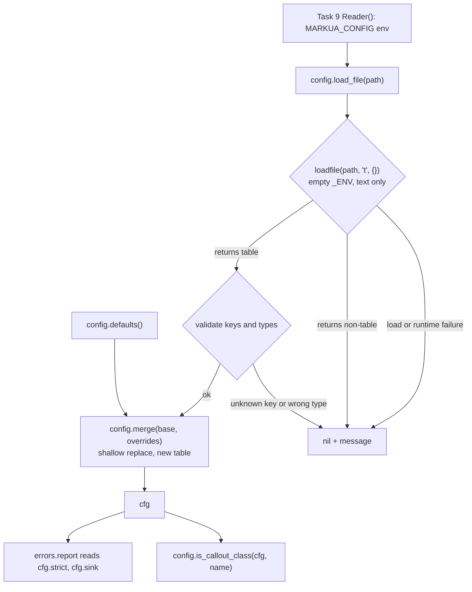

# Reader Config and Class Validation - Plan

## Goal Capsule

- **Objective:** Ship `src/markua/config.lua` and `test/config_spec.lua` — the reader's configuration module: documented defaults, book-level overrides, sandboxed config-file loading, and callout-class lookup. This is `docs/plan.md` Phase 2, Task 4, tracked as GitHub issue #5.
- **Authority hierarchy:** `docs/plan.md` Task 4 is the specification. `AGENTS.md` hard constraints override any plan detail that contradicts them. This plan's Key Technical Decisions govern where it deliberately corrects the plan's draft code. GitHub issue #5 is a stale pointer, not a spec.
- **Execution profile:** Test-first, one unit per commit, on branch `5-task-4-reader-config-with-overridable-callout-classes`. `docs/plan.md` prescribes this cycle: write the failing test, watch it fail, implement the minimum, watch it pass.
- **Stop conditions:** Stop and surface rather than guess when a decision would change what a later task consumes — `errors.report` already reads `cfg.strict` and `cfg.sink`, and Tasks 5, 6, and 9 read `callout_classes`, `index_keys`, and `load_file`.
- **Tail ownership:** The caller owns simplification, review, commit, and PR.

---

## Product Contract

### Summary

Add a pure-Lua configuration module that supplies the reader's defaults, accepts a book-level overrides file, and answers whether a name is a callout class. The module is data plus three small functions; the work that carries risk is the override path, which reads a file an author wrote and must fail loudly rather than silently ignoring a typo.

### Problem Frame

The documented Markua 0.30 callout class set includes `note`, but real Leanpub builds reject it, and individual books narrow the set further. `AGENTS.md` makes this a hard constraint: blurb and aside classes are configurable, not hardcoded. Nothing in the reader can hold that list as a branch.

Three later tasks already depend on the shape this module defines, and one shipped module already reads it: `errors.report` in `src/markua/errors.lua` branches on `cfg.strict` and writes to `cfg.sink`. Task 5 calls `config.is_callout_class`, Task 6 iterates `cfg.index_keys`, and Task 9's `Reader()` calls `config.load_file` then `config.merge`. The contract is therefore load-bearing before its first consumer lands.

### Requirements

#### Defaults and lookup

- R1. `config.defaults()` returns the documented Markua 0.30 callout classes: `warning`, `tip`, `note`, `information`, `error`, `question`, `discussion`, `exercise`.
- R2. `config.defaults()` returns `index_keys` as `{"ix", "i"}` — `ix` is the spec form, `i` the widespread real-world variant.
- R3. `config.defaults()` sets `strict = true`.
- R4. `config.is_callout_class(cfg, name)` reports whether `name` is in `cfg.callout_classes`.

#### Override merging

- R5. `config.merge(base, overrides)` returns a new table and mutates neither argument.
- R6. An override replaces a base value outright rather than merging into it, so `callout_classes = {"tip"}` narrows the set to exactly `tip`.
- R7. `config.merge(base, nil)` returns a copy of `base`.

#### Config file loading

- R8. `config.load_file(path)` loads a Lua chunk that returns a table and yields that table.
- R9. A config file cannot reach the filesystem, spawn a process, or `require` a module. It is evaluated for its return value, not run as a program with library access. It is not sandboxed against resource exhaustion — see Risks.
- R10. `load_file` returns `nil` plus a message — never raises — for a missing file, a syntax error, a runtime error, or a non-table return.
- R11. `load_file` refuses precompiled bytecode.

#### Override validation

- R12. `load_file` rejects an override key the reader does not recognize, naming the key. The recognized keys are exactly `callout_classes` and `index_keys`.
- R13. `load_file` rejects a recognized key whose value is not an array of strings, naming the key and what was expected. Both recognized keys carry that same shape, so one rule covers both, including their elements.
- R14. `load_file` rejects `strict` from a config file, naming `--lenient` as the channel that sets it.

#### Plan synchronization

- R15. `docs/plan.md` Task 4 embeds `src/markua/config.lua` and `test/config_spec.lua` byte-identically with the shipped files.

### Scope Boundaries

- Reading `MARKUA_CONFIG` and `MARKUA_LENIENT` from the environment belongs to Task 9's `Reader()`, which already contains that code in `docs/plan.md`. Task 12's `bin/markua` only translates the `--lenient` and `--config` flags into those environment variables. This task supplies `load_file` and `merge`; it calls neither.
- `cfg.sink` stays an injection seam for tests. It is consumed by `errors.report`, absent from `defaults()`, and not settable from a config file.
- Override validation (R12, R13, R14, U3) is **not** in `docs/plan.md` Task 4's Step 3 draft, whose `merge` accepts any key. It is added here per KTD5 as a deliberate extension, not a restatement of the origin.

#### Deferred to Follow-Up Work

- Bounding a config file's resource use is deferred. See Risks for the vectors and the trust premise that makes deferral acceptable today.

---

## Planning Contract

### Key Technical Decisions

- KTD1. **`docs/plan.md` is the specification; the GitHub issue is not.** (session-settled: user-directed — chosen over treating issue #5's body as the spec: issue bodies go stale, as issue #4 did by staying open after its work merged, and `AGENTS.md` names the plan authoritative.) Governs R1-R15.
- KTD2. **Ship `load_file` in this task, against the plan's own Interfaces list.** Task 4's Interfaces name only `defaults`, `merge`, and `is_callout_class`, but its Step 3 implements `load_file`, and Task 9's `Reader()` calls `config.load_file(cfg_path)` then `config.merge(cfg, overrides)`. The Interfaces list is incomplete; the implementation and its downstream consumer agree with each other. Governs R8-R11.
- KTD3. **A config file is a Lua chunk loaded with an empty environment, not JSON.** `loadfile(path, "t", {})` keeps the module dependency-free and pure, which `AGENTS.md` requires because busted runs under system Lua. Verified on the pinned Lua 5.4.8: a config calling `os.execute` fails with `attempt to index a nil value (global 'os')`, `pcall` catches it, and mode `"t"` refuses bytecode. Governs R9, R11.
- KTD4. **Validate at `load_file`, the trust boundary; keep `merge` a pure combine.** A config file is the only untrusted input; `merge` is also called programmatically with values the reader itself constructed. Validating in one place keeps the boundary explicit and leaves `merge` trivially testable. Governs R12, R13.
- KTD5. **An unrecognized override key is a hard error, not a silent no-op.** A config file is external input crossing a trust boundary, so it is validated on arrival: a mistyped `callout_class` that silently changes nothing gives the author no signal their override was ignored. `AGENTS.md`'s "unknown constructs are hard errors" rule is stated for Markua `{...}` attribute lines rather than config keys, so it is the precedent this follows by analogy, not the authority that compels it. This extends the plan's Step 3 draft, which merges any key. Governs R12, R13, R14.
- KTD6. **Shallow replace, not deep merge.** `callout_classes = {"tip"}` must narrow the set to exactly `tip` rather than appending to the documented eight — narrowing is the whole point of the override. Task 4's own test asserts `note` becomes unknown after the override. Governs R6.
- KTD7. **Neither `sink` nor `strict` is settable from a config file.** `errors.report` reads `cfg.sink` and falls back to stderr when it is nil, so a declared default buys nothing and a config file cannot supply a file handle anyway. `strict` is excluded for a sharper reason: `Reader()` applies `--lenient` to `cfg.strict` *before* it merges the config file, and KTD6's shallow replace means a file setting `strict = true` would silently cancel the flag the user just passed. Keeping both keys on a single channel removes the collision instead of documenting a precedence rule nobody would remember. Governs R12, R14.
- KTD8. **Re-sync the plan's embedded copies in the same PR.** (session-settled: user-approved — chosen over letting the embedded draft drift from shipped code: `docs/plan.md` calls its embedded code "the shipped file, verbatim", and no CI job or pre-commit hook checks it.) KTD5 changes the draft, so the sync is required rather than incidental. Governs R15.
- KTD9. **Three verification gates, and the pandoc oracle is not one of them here.** (session-settled: user-approved — chosen over treating busted alone as sufficient: PR #17 established busted, luacheck, and the pandoc differential oracle as the completion bar.) The oracle compares line classification against pandoc; this task emits no markdown and classifies no lines, so it is out of scope for this change rather than skipped silently.

### High-Level Technical Design

Config resolution spans this task and Task 9. This task owns the module; Task 9's `Reader()` owns the environment reads that feed it, and Task 12's `bin/markua` sets those variables from CLI flags.

### Risks

- **A config file can exhaust memory even inside the empty environment.** String concatenation and `for` are VM primitives, and the string metatable binds to the string type rather than through `_ENV`, so neither needs a global. Measured on the pinned Lua 5.4.8: `s = s .. s` twenty-two times allocates 4 MB in about 1 ms, and thirty doublings reach roughly 1 GB; `("A"):rep(n)` is reachable the same way. `loadfile(path, "t", {})` does not and cannot bound this, and U3's validation runs after `pcall` returns, so it inspects an already-executed chunk. The non-terminating `while true do end` case is the same class and less severe — a hang can be killed, an allocation spike can take the host's other processes with it.
- **The mitigation is a trust premise, not a control.** `MARKUA_CONFIG` comes from `--config <path>` on `bin/markua`, so the file is normally the author's own, in their own checkout, run by them. Deferring a resource budget is reasonable under exactly that shape. It stops being reasonable if `--config` is ever pointed at a path whose contents an outside contributor can influence — a PR-built book preview in a multi-contributor repository is the realistic version. This repository's CI does not do that today. Anyone who adopts that pattern needs a budget (a `debug.sethook` count hook around the `pcall`) first.

### Assumptions

- The recognized config-file keys are exactly `callout_classes` and `index_keys`, and both carry an array of strings. `strict` reaches `cfg` through `--lenient` or `opts.strict` in Task 9's `Reader()`, never through a file.
- `is_callout_class` assumes a valid `cfg`. Validation happens at the boundary, and unlike `errors.report` this is not the error path, so a defensive type check would add noise without preventing a masked error.
- Both `defaults()` and `merge` return freshly constructed tables per call, so no caller aliases another's arrays.

### Sequencing

U1 establishes the shape every other unit builds on. U2 adds the file boundary. U3 hardens that boundary. U4 syncs the plan once the shipped code is final, so it is deliberately last.

---

## Implementation Units

### U1. Defaults, merge, and callout-class lookup

- **Goal:** Create `src/markua/config.lua` with `defaults`, `merge`, and `is_callout_class`.
- **Requirements:** R1, R2, R3, R4, R5, R6, R7
- **Dependencies:** none
- **Files:**
  - `src/markua/config.lua` (create)
  - `test/config_spec.lua` (create)
- **Approach:**
  1. Write `test/config_spec.lua` with the four scenarios `docs/plan.md` Task 4 Step 1 specifies, plus the immutability and independence scenarios below.
  2. Implement `defaults()` returning the three documented fields, constructing fresh tables per call.
  3. Implement `merge` as a shallow copy of `base` overwritten by `overrides`, tolerating a nil `overrides`.
  4. Implement `is_callout_class` as a linear scan over `cfg.callout_classes`.
- **Execution note:** Start red — `busted test/config_spec.lua` must fail with `module 'src.markua.config' not found` before any implementation.
- **Patterns to follow:** `src/markua/errors.lua` for module shape (`local M = {}` … `return M`) and comment density. Comments explain why, per `AGENTS.md`.
- **Test scenarios:**
  - `defaults()` reports `warning` and `discussion` as callout classes and `nonsense` as not one.
  - `defaults()` returns `index_keys` exactly `{"ix", "i"}`, in that order.
  - `defaults()` sets `strict` to true.
  - `merge(defaults(), { callout_classes = { "tip" } })` makes `tip` a callout class and `note` not one.
  - `merge` does not mutate its base: overriding `strict` to false leaves the base table's `strict` true.
  - `merge(base, nil)` returns a table equal to `base`.
  - Two `defaults()` calls return independent tables: appending to one's `callout_classes` does not change the other's.
- **Verification:** `busted test/config_spec.lua` passes; `luacheck src/markua/config.lua test/config_spec.lua` is clean.

### U2. Sandboxed config-file loading

- **Goal:** Add `config.load_file(path)` so a book can ship an overrides file, and cover the sandbox the plan's draft leaves untested.
- **Requirements:** R8, R9, R10, R11
- **Dependencies:** U1
- **Files:**
  - `src/markua/config.lua` (modify)
  - `test/config_spec.lua` (modify)
- **Approach:**
  1. Add failing scenarios for the success path, each failure mode, and the sandbox.
  2. Implement `load_file` per `docs/plan.md` Task 4 Step 3: `loadfile(path, "t", {})`, then `pcall` the chunk, then a `type(result) ~= "table"` guard, returning `nil` plus a message at each step.
  3. Write fixture config files from the spec rather than committing them, so the spec stays self-contained. Create each with `os.tmpname()` and `io.open`, track the paths, and `os.remove` them in an `after_each` so an assertion failure mid-scenario still cleans up. No spec in `test/` writes to disk yet, so this unit sets that precedent — keep it in one local helper rather than repeating it per scenario.
- **Execution note:** The sandbox scenarios are the point of this unit — the plan ships `load_file` with zero coverage, so a regression that widened `_ENV` would pass today's suite silently.
- **Patterns to follow:** `errors.raise` uses `error(…, 0)` to suppress position prefixes; `load_file` takes the opposite approach and returns rather than raises, so the caller decides whether a bad config is fatal. Task 9's `Reader()` is that caller and turns it into an error.
- **Test scenarios:**
  - A file returning `{ callout_classes = { "tip" } }` loads and yields that table.
  - A missing path returns nil and a message naming the path.
  - A file with a syntax error returns nil and a message naming the path.
  - A file returning `42` returns nil and a message saying a table is required.
  - A file calling `os.execute` returns nil and a message — the empty environment makes `os` nil and `pcall` catches it.
  - A file calling `require` returns nil and a message, for the same reason.
  - A precompiled bytecode file is refused rather than executed.
- **Verification:** `busted test/config_spec.lua` passes, including every sandbox scenario; `luacheck` clean.

### U3. Reject unknown and mistyped overrides

- **Goal:** Make a typo in a book's config file a loud failure instead of a silent no-op.
- **Requirements:** R12, R13, R14
- **Dependencies:** U2
- **Files:**
  - `src/markua/config.lua` (modify)
  - `test/config_spec.lua` (modify)
- **Approach:**
  1. Add failing scenarios for an unknown key and for each recognized key carrying the wrong type.
  2. Declare the recognized keys and their expected types as a table, not a branch chain, matching how `scanner.lua` holds its fence patterns.
  3. Validate the loaded table inside `load_file` before returning it, returning `nil` plus a message that names the offending key.
- **Execution note:** This corrects the plan's Step 3 draft, which merges any key. Keep the correction visible in a comment so the re-sync in U4 carries the reason forward.
- **Patterns to follow:** `AGENTS.md` — "Lua patterns, not regex" and its table-driven corollary; `src/markua/attributes.lua` uses named pattern constants for the same reason.
- **Test scenarios:**
  - A file setting `callout_class` (singular) returns nil and a message naming `callout_class` as unrecognized.
  - A file setting `strict = false` returns nil and a message naming `--lenient` as the channel that sets it, so an author who tries the file route is told where to go.
  - A file setting `callout_classes = "tip"` returns nil and a message naming the key and that an array of strings is expected.
  - A file setting `index_keys = { 1, 2 }` returns nil and a message naming the key and that an array of strings is expected — element types are checked, not just the outer table.
  - A file setting only `callout_classes` loads successfully — a partial override is legal.
  - A file setting both recognized keys loads successfully.
- **Verification:** `busted test/config_spec.lua` passes; `just test` passes as a whole; `luacheck src test` clean.

### U4. Re-sync the plan's embedded Task 4 code

- **Goal:** Restore `docs/plan.md` Task 4's promise that its embedded code is the shipped file verbatim.
- **Requirements:** R15
- **Dependencies:** U1, U2, U3
- **Files:**
  - `docs/plan.md` (modify)
- **Approach:**
  1. Replace Task 4 Step 1's `lua` block with the shipped `test/config_spec.lua` byte for byte.
  2. Replace Task 4 Step 3's `lua` block with the shipped `src/markua/config.lua` byte for byte.
  3. Add `load_file` to Task 4's Interfaces list, which omits it today.
  4. Update Step 4's expected count, which reads "PASS, 4 successes" and no longer matches.
- **Execution note:** Run the byte-identity extraction after the final edit to `src/markua/config.lua`, not before. A pre-commit hook that rewrites a file after the sync desynchronizes it again silently.
- **Test expectation:** none — documentation synchronization with no behavior change.
- **Verification:** Extract both fenced `lua` blocks from Task 4 and confirm each equals the corresponding shipped file exactly, the same check applied to all four files in PR #17.

---

## Verification Contract

| Gate | Command | Applies to | Done signal |
| --- | --- | --- | --- |
| Unit specs | `busted test/config_spec.lua` | U1, U2, U3 | All scenarios pass |
| Full suite | `just test` | U1, U2, U3 | 108 successes, 0 failures |
| Lint | `luacheck src test` | U1, U2, U3 | 0 warnings, 0 errors |
| Plan sync | Extract Task 4's `lua` blocks and compare to the shipped files | U4 | Both compare byte-identical |

The pandoc differential oracle is out of scope for this change, per KTD9: it compares line classification against pandoc, and this task neither classifies lines nor emits markdown.

Run specs through the pinned toolchain. `busted` resolves to mise's Lua 5.4.8 through its wrapper, which matches the interpreter pandoc embeds. A bare `lua` on the shell PATH may be a different build and is not the target runtime.

---

## Definition of Done

- Every requirement R1-R15 is met and covered by a scenario or, for R15, by the byte-identity check.
- `src/markua/config.lua` touches no `pandoc` global, per the `AGENTS.md` purity constraint that lets busted run under system Lua.
- `just test` and `luacheck src test` are both green.
- `docs/plan.md` Task 4 embeds both shipped files byte-identically, its Interfaces list names `load_file`, and its expected-count line matches reality.
- No exploratory or dead-end code remains — no commented-out alternatives, no unused helper left from an approach that did not pan out.
- Comments explain why, not what, matching the density of `src/markua/errors.lua` and `src/markua/attributes.lua`.

---

## Open Questions

Deferred, non-blocking:

- Should `is_callout_class` be case-insensitive? Markua's spec writes classes lowercase and no consumer normalizes case yet. Task 5 is the first consumer and is the right place to settle it against real manuscripts.
- Should a book be able to extend rather than replace `index_keys`? No book has asked, and `merge`'s replace semantics are what narrowing `callout_classes` needs. Revisit only if a real manuscript uses a third index key.

---

## Sources & Research

- `docs/plan.md` Task 4 — the specification, including both embedded `lua` blocks and the documented `markua.config.lua` override example.
- `docs/plan.md` Task 9 — `Reader()` at `docs/plan.md:3126` shows the real call sequence: `config.defaults()`, the `--lenient` and `opts.strict` assignments, then `config.load_file(cfg_path)` and `config.merge(cfg, overrides)`.
- `src/markua/errors.lua` — `report` already reads `cfg.strict` and `cfg.sink`, so this task's shape is constrained by shipped code.
- `AGENTS.md` — purity constraint, unknown constructs as hard errors, table-driven matching, and configurable blurb classes.
- `docs/solutions/conventions/execute-dont-read-when-reviewing-plans.md` — why the sandbox claim in this plan was executed on the pinned interpreter rather than read from the draft's comment.
- Lua 5.4.8 sandbox behavior, verified on the mise-pinned interpreter: `loadfile(path, "t", {})` yields a chunk whose `os`, `io`, and `require` are nil; `pcall` converts the resulting error into a return value; mode `"t"` refuses bytecode; a missing file reports `cannot open <path>: No such file or directory`.
