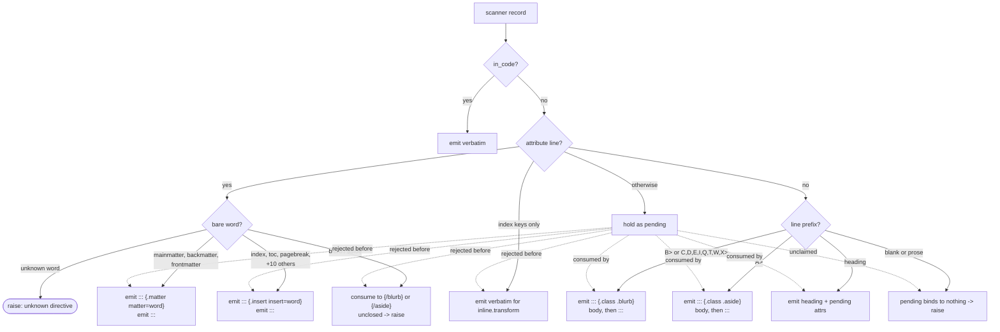

# Block Constructs, Directives, and Part Headings - Plan

## Goal Capsule

- **Objective:** Ship `src/markua/blocks.lua` and `test/blocks_spec.lua` — blurbs in all three syntaxes, asides in both, the complete Markua 0.30 bare-word directive set, and `{class: part}` heading attachment. This is `docs/plan.md` Phase 2, Task 5, tracked as GitHub issue #6, including the `{index}` question filed as a comment on that issue.
- **Authority hierarchy:** `AGENTS.md` hard constraints are absolute. Below them, the **Markua 0.30 specification** (`markuadoc/markua-spec` at tag `v_0_30`, `spec.txt`) is authoritative on *input syntax*; where `docs/plan.md`'s Task 5 reference source demonstrably diverges from it, the spec wins and this plan's KTDs record the correction. `docs/plan.md` remains authoritative on *output shape* and architecture. Issue #6's body restates the plan and inherits its gaps; it is a pointer, not a spec.
- **Execution profile:** Test-first, one unit per commit, on branch `6-task-5-blurbs-asides-matter-directives-and-part-headings`. `docs/plan.md` prescribes the cycle: write the failing test, watch it fail, implement the minimum, watch it pass.
- **Stop conditions:** Stop and surface rather than guess when a decision changes what a later task consumes. `blocks.transform`'s output is consumed by Task 9's `Reader()`, Task 11's callout filter, and Task 8, which reopens this same module. Adding a bare word here also obliges Task 7's `resources.lua`; see System-Wide Impact.
- **Tail ownership:** The caller owns simplification, review, commit, and PR.

---

## Product Contract

### Summary

Create the module that owns Markua's blurb, aside, and directive constructs. Executing `docs/plan.md`'s Task 5 reference source against the merged scanner, attribute parser, config, and errors modules shows it is internally sound — 15 of 15 of its own scenarios pass — but measuring it against the Markua 0.30 specification shows it recognizes roughly half the block constructs authors actually write. Eight syntactic-sugar blurb prefixes pass through as literal prose, thirteen directives abort the conversion, and the fenced aside form aborts too. This plan closes those gaps and settles the `{index}` question that issue #6 asks to resolve before the task ships. It does not close the whole block-level surface: the fenced `{blockquote}` form is a known, deliberately deferred gap.

### Problem Frame

`blocks.lua` is the widest-surface module in the reader, and its two failure modes are the two the project exists to prevent.

The first is silent corruption. A manuscript writing `T> Press Ctrl-R.` — the documented shorthand for a tip blurb — produces the literal string `T> Press Ctrl-R.` in the finished book, with no warning anywhere. Eight such prefixes are specified and all eight are unhandled.

The second is aborting a real manuscript. `AGENTS.md` makes an unrecognized `{...}` attribute line a hard error, deliberately, so braces never leak into a book. That rule is only safe if the recognized set is actually complete. It is not: the reference recognizes three bare words, and Markua 0.30 defines fifteen. A book that positions its own index with `{index}` fails to convert — in the one tool whose headline feature is carrying index entries into Word.

Issue #6 records the second problem and asks for two things before the task ships: the complete directive list, and what each should lower to. Both are answered from the spec source rather than inferred. Answering them removes the abort; it does not by itself produce an index, because no scoped task yet consumes the marker. That gap is named in Risks rather than treated as closed.

### Requirements

#### Blurbs

- R1. A run of `B>` lines becomes a fenced div. The callout class is the head of the class list and `.blurb` follows it, per the pinned ordering in `docs/plan.md`'s Key Technical Decisions.
- R2. An attribute list carrying a class, on the line directly above a `B>` run, supplies that run's callout class.
- R3. The fenced form `{blurb, class: X}` … `{/blurb}` produces the identical div.
- R4. A `B>` run with no class defaults to `information`.
- R5. Each of the eight syntactic-sugar prefixes opens a blurb of its documented class: `C>` center, `D>` discussion, `E>` error, `I>` information, `Q>` question, `T>` tip, `W>` warning, `X>` exercise.
- R5a. An explicit `{class: X}` above a sugar prefix overrides the prefix's implied class and the conversion succeeds. The spec's worked example is `{class: tip}` above `W>`, which renders as a tip. The spec also calls the combination an authoring error, so the override emits a warning through the existing sink rather than aborting.
- R6. An attribute list that supplies a class to a callout must name exactly one class registered in `cfg.callout_classes`. If none of its classes is registered, that is a hard error naming the offending class or classes. A class differing from a known one only by letter case additionally names the known spelling.
- R7. `config.defaults().callout_classes` includes `center`.
- R8. Classes beyond the registered callout class are decorative: they are preserved and carried into the emitted div, after the callout class and before the `.blurb` or `.aside` marker. Markua reaches this case through one whitespace-separated value — `{class: "tip wide"}` parses to `tip` plus `wide` — not through a per-class shorthand.
- R9. An unclosed `{blurb}` is a hard error naming its opening line, not a block running silently to end of input.
- R10. A `{/blurb}` line inside a code fence does not close the blurb.

#### Asides

- R11. A run of `A>` lines becomes `::: {.aside}` … `:::`.
- R12. The fenced form `{aside}` … `{/aside}` produces the identical div, and an unclosed `{aside}` is a hard error.
- R13. An attribute list on the line directly above an `A>` run is applied to the aside div, with any callout class as the head and `.aside` last. It is never silently discarded, and its class is validated exactly as a blurb's is.
- R13a. A fenced aside carries its attributes inline as `{aside, class: X}`, mirroring `{blurb, class: X}`. A separate attribute list on the line above a fenced opener binds to nothing and raises, matching the spec's explicit prohibition for `{blurb}`.

#### Directives

- R14. The recognized bare-word directives are exactly the Markua 0.30 set: the structural directives `mainmatter` and `backmatter`; `pagebreak`; the front-matter insertion directives `half-title`, `series-title`, `title-page`, `copyright`, `dedication`, `epigraph`, `toc`, `figures`, `tables`; and the back-matter insertion directives `index`, `exercise-answers`, `quiz-answers`.
- R15. `frontmatter` is accepted although Markua 0.30 states it does not exist, because real manuscripts write it. It is treated as a structural directive.
- R16. A structural directive emits `::: {.matter matter="<word>"}` followed by `:::` — a self-closing marker, not a wrapping pair.
- R17. An insertion directive emits `::: {.insert insert="<word>"}` followed by `:::`, the same self-closing shape.
- R18. Both marker families carry the bare word verbatim, so no mapping table exists between Markua names and emitted names.
- R19. A bare word outside R14 and R15 remains a hard error naming file, line, and the offending word.

#### Attribute-list lifecycle

- R20. An attribute list binds only to the element on the line directly below it. A blank line terminates it, per the spec's rule for blurbs.
- R21. An attribute list that binds to nothing is a hard error naming file, line, and the offending text — whether it precedes a plain paragraph, a blank line, a second attribute list, a bare-word directive line, a fenced `{blurb}` or `{aside}` opener, or end of input.
- R22. Under `--lenient`, a rejected attribute list is re-emitted at its original position, never after intervening lines.
- R23. An attribute list holding only index keys is re-emitted verbatim for `inline.transform`, which runs later and owns index markers.
- R24. `{class: part}` on the line above a heading attaches to that heading as `{.part}`.
- R25. A body line that would close the fence this pass opened is backslash-escaped rather than rejected, matching pandoc's own markdown writer.

#### Fence awareness

- R26. No line inside a fenced code block is transformed. A JSON block containing `{"class": "tip"}`, and a fenced block containing `B>` or `{/blurb}`, pass through untouched and emit no `:::`.

#### Documentation integrity

- R27. `docs/plan.md` Task 5 embeds the shipped module and spec byte-identically, and its expected-count line matches reality. Task 8's expected count is corrected for the same reason.
- R28. `docs/plan.md`'s embedded code for the two downstream tasks this work invalidates is corrected in place: Task 7's `BLOCK_BARE` learns every bare word this task recognizes, and Task 11's `Div` handler checks the head class before its aside fallback.
- R29. `CONCEPTS.md`'s Aside entry is corrected — asides do have a fenced form — and an `Insertion directive` entry is added beside the existing `Matter directive` entry, which names the same construct this plan calls a structural directive.
- R30. `docs/plan.md`'s `{index}` entry under Deferred / Open Questions is marked settled, pointing at this plan, and the deferred `{blockquote}` gap is recorded in its place.

### Scope Boundaries

In scope: `src/markua/blocks.lua`, `test/blocks_spec.lua`, one added default in `src/markua/config.lua`, and documentation re-sync.

The in-scope line is drawn at the two constructs this task's own title names — blurbs and asides — plus the directive set `docs/plan.md` requires it to settle. Every failure mode of those constructs is in scope, including ones issue #6 did not enumerate, because shipping a `blocks.lua` that mangles `T>` or aborts on `{aside}` would mean revisiting this module immediately. Constructs outside those two are deferred below even where they are structurally similar.

#### Deferred to Follow-Up Work

- **`{blockquote}` … `{/blockquote}`** — the spec's fenced blockquote form (`spec.txt:6410-6440`), a same-tier extension sitting immediately before the Asides section. It aborts today for the same reason `{aside}` does, and it reuses the same fenced-form machinery, but a blockquote is neither a blurb nor an aside and is outside what Task 5 names. This needs its own task; it is the one known gap in this plan's block-level coverage.
- **Lowering an `.insert` marker into generated content.** Needs a new task, not an existing one — see Risks. Pandoc has no node for a generated index, table of contents, or list of figures, and this reader converts one file per invocation while those constructs are whole-book. The marker preserves author intent and placement; producing the content is a separate job.
- Enforcing the spec's rule that `{mainmatter}` and `{backmatter}` may each appear only once per document.
- `{blurb}` icon extension attributes.

#### Outside this task

- Quizzes and exercises, rejected by Task 8. Note that `quiz-answers` and `exercise-answers` are *directives* under R14 and are distinct bare words from `quiz` and `exercise`; recognizing them does not admit the constructs themselves.
- Math fences, which Task 8 adds to this same module.

---

## Planning Contract

### Key Technical Decisions

- KTD1. **The Markua 0.30 spec source is the authority on input syntax; `docs/plan.md`'s reference code is not.** `docs/solutions/conventions/execute-dont-read-when-reviewing-plans.md` requires executing what the plan ships rather than reading it. Executed, the Task 5 reference passes all 15 of its own scenarios against the merged modules — its API assumptions carry no drift. Measured against `spec.txt` at tag `v_0_30`, it is missing eight blurb prefixes, twelve directives, and the fenced aside. The reference is internally correct and externally incomplete, which is exactly the failure a self-consistent test suite cannot surface. Governs R5, R12, R14, R20.

- KTD2. **The directive set is closed, so the hard-error rule stays.** `spec.txt` enumerates the directives in two explicitly-closed lists (lines 2320-2400). With the full set recognized, an unrecognized bare word really is unrecognized, and `AGENTS.md`'s hard-error constraint keeps its original meaning instead of becoming a tax on valid manuscripts. Widening the rule to pass unknown bare words through was rejected: it reintroduces the brace-leakage failure the constraint exists to prevent, and it is unnecessary once the set is complete. Governs R14, R19.

- KTD3. **Insertion directives get their own marker family, `::: {.insert insert="<word>"}`.** They are semantically distinct from structural directives — one positions generated content, the other switches the book's numbering mode — and the spec separates them by section. Reusing `.matter` would conflate them and force a downstream filter to re-derive the split from a word list, which is the mapping table the matter KTD exists to avoid. The shape is parallel and carries the bare word verbatim, so the no-mapping-table property holds for both families. Verified against the reader's exact `TARGET_FORMAT`: `::: {.insert insert="index"}` followed by `:::` parses to `Div ("",["insert"],[("insert","index")]) []`, and renders harmlessly in HTML, LaTeX, DocBook, ICML, and a well-formed DOCX. Governs R17, R18.

- KTD4. **`pagebreak` joins the insertion family.** `spec.txt:2219` titles its section "The pagebreak directive" but groups it with neither the structural pair nor the two closed insertion lists, so the spec does not settle which family it belongs to. It inserts something at a point, which is what `.insert` means, and folding it in avoids a third marker family with one member. Governs R14, R17.

- KTD5. **`{frontmatter}` is accepted despite the spec deleting it.** `spec.txt:2288` is explicit: "Note that there is no need for a `{frontmatter}` directive, so it does not exist. A Markua Processor should ignore it if it is encountered, but a warning can be provided." Real manuscripts write it anyway. Aborting on it would fail books that Leanpub itself builds, and the spec's own remedy is to ignore rather than reject. Emitting an inert marker *is* ignoring it, while preserving the author's intent for a downstream filter — strictly better than dropping the line. The optional warning is not emitted, because a correct-by-Leanpub manuscript should convert quietly. Governs R15.

- KTD6. **A blank line terminates a pending attribute list.** `spec.txt:6647` states the rule directly: "The attribute list must either directly precede the `B>` with no blank line between it and the `B>`, or it must be combined with the `{blurb}` block opening." The reference holds a pending list across blank lines, which accepts illegal Markua and, under `--lenient`, moves the line: measured, `{class: tip}` / blank / `Just a paragraph.` re-emits as blank / `{class: tip}` / `Just a paragraph.`, merging the braces into the following paragraph as visible text. That is the same defect `resources.lua` already carries a comment about having fixed; this makes the two passes agree. Governs R20, R22.

- KTD7. **An attribute list above an `A>` run is applied; above a fenced opener it raises.** Measured, the reference silently discards the list — `{class: bogus}` above an `A>` run produces a bare `::: {.aside}` with no error, losing author intent and violating the hard-error constraint. For the `A>` form, applying beats rejecting: it is the placement `spec.txt:1641-1645` documents for a block element, and `CONCEPTS.md` already treats asides as sharing the blurb's configurable-class treatment. For the *fenced* form the answer inverts, because `spec.txt:6647-6656` is explicit that an attribute list preceding a `{blurb}` opener "is **NOT** legal Markua syntax" and requires it "combined with the block opening" instead. Asides mirror blurbs, so a fenced aside takes `{aside, class: X}` and a preceding list raises. Governs R13, R13a.

- KTD8. **Callout-class matching stays case-sensitive, with a case-aware error message.** This settles the question `docs/plans/2026-08-10-001-feat-reader-config-and-class-validation-plan.md` deferred to Task 5. Every class in `spec.txt` is lowercase, and the sugar prefixes are the only uppercase surface — they map to lowercase classes rather than implying case-insensitive lookup. Folding case would also make a config file's narrowed list ambiguous about which spelling it authorized. The cost of strictness is a confusing error on `{class: Tip}`, so the message names the known spelling instead. Governs R6.

- KTD9. **`center` is added to the shipped defaults.** `spec.txt:6895-6923` documents `C>` and `{class: center}` as a blurb class, and the current defaults omit it, so both forms raise today. This is a one-element data change in `config.lua`, not a structural one. Governs R7.

- KTD10. **Sugar prefixes are a table, not a branch chain.** `AGENTS.md` requires multi-alternative matching to loop over a table because Lua patterns have no alternation, and `scanner.lua` and `config.lua` both already hold their alternatives as data. The prefix table also keeps `B>` and the eight sugar letters on one code path, so the head-class ordering and delimiter escaping cannot drift between them. Governs R5.

- KTD10a. **An explicit class beats the sugar prefix, and the combination warns rather than aborts.** `spec.txt:6878-6888` states it directly — "specifying a class in metadata overrides what the syntactic sugar does, and is also an error" — and its worked example renders `{class: tip}` above `W>` as a tip blurb, not as a failed conversion. KTD1 makes the spec authoritative on input syntax, so the reverse rule (prefix wins, conflict raises) would both contradict this plan's own authority hierarchy and reject a document the spec shows rendering. The spec's "is also an error" is honored as a warning through the sink `errors.warn` already provides, which keeps the conversion running while telling the author their two signals disagree. Governs R5a.

- KTD10b. **The reference's raise-when-none-registered lookup is correct, and no class provenance is needed.** An earlier draft of this plan asserted the opposite and would have required `attributes.parse` to record whether each class arrived via a `.name` shorthand or a `class:` key. `spec.txt:1611-1640` settles it: a Markua attribute list is "one or more key-value, comma-separated pairs" and the spec contains no `.class` or `#id` shorthand anywhere — Markua writes `{id: foo}`, not `{#foo}`. So every class in a real manuscript arrives through `class:`, and `attributes.parse` splits that one value on whitespace exactly as pandoc does. The decorative case is therefore `{class: "tip wide"}` → `tip` plus `wide`, where a registered class *is* present, and scanning the list for a registered callout class resolves it correctly. `attributes.parse` still accepts `.name` because it is a permissive tokenizer, but that input is not Markua and no requirement here is written against it. Governs R6, R8.

- KTD11. **Re-sync `docs/plan.md`'s embedded copies in the same PR.** `docs/plan.md` calls its embedded code the shipped file verbatim, and no CI job or hook checks it. The residual record for Task 4 notes this broke once in eight commits on that branch, caught only by hand. This plan changes the embedded code substantially, so the sync is required rather than incidental. Governs R27.

- KTD12. **Five verification gates, and the pandoc differential oracle is one of them this time.** The gates are busted, luacheck, the pandoc oracle, the plan-sync byte-identity check, and U6's doc-corrections inspection. Task 4 excluded the oracle because that module emitted no markdown. This one does emit markdown, and KTD3's marker shape was settled by running pandoc against the reader's own `TARGET_FORMAT`. Every emitted construct is checked the same way before its expectation is frozen as a busted assertion, per `docs/solutions/architecture-patterns/match-the-readers-exact-target-dialect.md`.

### High-Level Technical Design

`blocks.transform` is a single pass over scanner records with one piece of carried state: the pending attribute list. Every exit from the pending state is accounted for, which is what keeps an unclaimed list from leaking braces or vanishing.

The pending list is the only state, and R21 requires every path out of it to be either a consumption or a hard error. There is no third path.

### Assumptions

- The directive set in R14 is complete for Markua 0.30. `spec.txt`'s two lists are explicitly closed and no other section of the 16,230-line file introduces a directive, but the remainder was not exhaustively swept for an informal prose mention. Adding a word later is a one-line table change, and the hard error names the offending word, so a miss is loud and cheap.
- An `.insert` marker produces no visible output until a filter claims it. That is intended: this reader converts one file per invocation and cannot generate a whole-book index.
- `A>` and the sugar prefixes are matched on the raw line, so a prefix inside a blockquote is not a blurb. This matches the reference and the scanner's own record shape, where `.text` is the unmodified line.

### Sequencing

U1 establishes the pass skeleton and the pending lifecycle every later unit depends on. U2 adds blurbs, U3 the sugar prefixes that reuse the blurb path, U4 asides. U5 adds the directive table, which is independent of the prefix work but shares the bare-word branch U1 creates. U6 re-syncs the documentation once the shipped code is final, so it is deliberately last.

---

## Implementation Units

### U1. Pass skeleton and attribute-list lifecycle

- **Goal:** `blocks.transform` walks scanner records, passes code through untouched, and accounts for every pending attribute list — consumed by a heading, re-emitted for `inline.transform`, or raised on.
- **Requirements:** R20, R21, R22, R23, R24, R25, R26
- **Dependencies:** none
- **Files:**
  - `src/markua/blocks.lua` (create)
  - `test/blocks_spec.lua` (create)
- **Approach:**
  1. Start from `docs/plan.md` Task 5's reference source, which executes correctly against the merged modules. Take it as the baseline rather than rewriting from scratch.
  2. Replace the blank-line branch that holds a pending list with one that rejects it, per KTD6. This is the behavioral change; the rest of the lifecycle is unchanged.
  3. Make every branch that can see a pending list without consuming it call `reject_pending` as its first action, before emitting anything of its own. That covers the blank-line branch, the directive branch, the index-only passthrough, and the fenced `{blurb}` and `{aside}` openers added in U2 and U4 — a preceding list is illegal above a fenced opener per R13a, so rejecting is the correct outcome there, not a dropped case. The branches that *consume* a pending list — `B>` runs, sugar prefixes, `A>` runs, and headings — are untouched by this rule. Resolving the pending list in the same loop iteration as the line that disqualified it keeps `reject_pending`'s existing append correctly positioned, so R22 needs no index bookkeeping. Do not track and rewrite an output index: measured, the reference re-emits a pending list *after* the matter marker that follows it, and an index-rewrite fix reads ambiguously between inserting and overwriting, where overwriting would destroy the marker already in that slot.
  4. Keep the index-only passthrough and the `{class: part}` heading attach as the reference has them; both are already correct.
- **Execution note:** Write the failing spec first and confirm it fails with `module 'src.markua.blocks' not found`, per `docs/plan.md`'s cycle and issue #6's first acceptance criterion.
- **Test scenarios:**
  - `{class: part}` above `# Foundations` yields `# Foundations {.part}`.
  - A JSON code block containing `{"class": "tip"}` passes through unchanged and the output contains no `:::`.
  - A fenced block containing `B>` and `{/blurb}` passes through unchanged and emits no `:::`.
  - An attribute list above a plain paragraph raises, and the message names the offending text.
  - An attribute list separated from a `B>` run by a blank line raises rather than binding across the blank.
  - An attribute list in the final position with no trailing newline raises.
  - A second attribute list directly above an unconsumed first one raises.
  - `{ix: "B-tree"}` on its own line is re-emitted verbatim and is not treated as a pending list.
  - Under `strict = false`, a rejected attribute list appears in the output before any line that followed it in the source, across a blank line.
  - Under `strict = false`, `{class: tip}` followed by `{pagebreak}` places the re-emitted `{class: tip}` before the pagebreak's own marker lines, not after them.
  - In strict mode, `{class: tip}` on the line above `{pagebreak}` raises — a directive line does not consume a pending list.
  - In strict mode, `{class: tip}` on the line above a fenced `{blurb}` opener raises, per R13a.
- **Verification:** `busted test/blocks_spec.lua` green; both lenient-position scenarios assert the output index, not merely the substring's presence.

### U2. Blurbs in both attribute-list syntaxes

- **Goal:** `B>` runs and the fenced `{blurb}` form both produce a callout div with the class at the head of the class list.
- **Requirements:** R1, R2, R3, R4, R6, R8, R9, R10
- **Dependencies:** U1
- **Files:**
  - `src/markua/blocks.lua` (modify)
  - `test/blocks_spec.lua` (modify)
- **Approach:**
  1. Emit the callout class ahead of `.blurb`. This is load-bearing, not cosmetic: pandoc's DocBook writer matches only the first class, so `{.blurb .tip}` degrades to a bare `<para>` with no error while `{.tip .blurb}` becomes a real `<tip>`.
  2. Keep the reference's class lookup semantics — scan for a registered callout class, raise when none is found (R6, KTD10b). No change is needed here; an earlier draft of this plan called for one and was wrong.
  3. Carry the decorative classes into the emitted div. The reference resolves one callout class and drops every other entry, so `{class: "tip wide"}` emits `::: {.tip .blurb}` and loses `wide` — measured. Have the div-opening helper take the whole class list and emit the callout class first, then the remaining classes in source order, then the `.blurb` marker last, giving `::: {.tip .wide .blurb}` (R8). The marker stays last so the head-class rule in `docs/plan.md`'s Key Technical Decisions still holds.
  4. Extend the unknown-class error to name a known spelling when the offender differs only by case, per KTD8.
  5. For the fenced form, terminate only on a `{/blurb}` line whose record is not `in_code`, so a code sample inside a blurb can contain the closing text.
- **Test scenarios:**
  - `{class: tip}` above a `B>` run yields `::: {.tip .blurb}` and the body text.
  - The class precedes `.blurb` in the emitted class list.
  - `{blurb, class: warning}` … `{/blurb}` yields `::: {.warning .blurb}`.
  - A `B>` run with no attribute list defaults to `::: {.information .blurb}`.
  - `{class: "tip wide"}` above a `B>` run yields `::: {.tip .wide .blurb}` — the callout class heads the list, the decorative class survives, and the marker stays last.
  - `{class: bogus}` above a `B>` run raises, and the message names `bogus`.
  - `{class: Tip}` raises and the message names both `Tip` and `tip`.
  - An unclosed `{blurb}` raises rather than running to end of input, and the message names the opening line.
  - A `{/blurb}` inside a fenced code block does not close the blurb.
  - A body line of exactly `:::` is emitted backslash-escaped.
  - Two `B>` runs separated by a blank line take their classes independently; the second does not inherit the first's.
- **Verification:** `busted test/blocks_spec.lua` green. Before freezing the class-ordering expectation, confirm with pandoc against the reader's `TARGET_FORMAT` that the emitted div parses to a `Div` whose first class is the callout class.

### U3. Syntactic-sugar blurb prefixes

- **Goal:** The eight documented shorthand prefixes open blurbs of their specified class, instead of passing through as literal prose.
- **Requirements:** R5, R5a, R7
- **Dependencies:** U2
- **Files:**
  - `src/markua/blocks.lua` (modify)
  - `src/markua/config.lua` (modify)
  - `test/blocks_spec.lua` (modify)
  - `test/config_spec.lua` (modify)
- **Approach:**
  1. Add a prefix-to-class table — `C` center, `D` discussion, `E` error, `I` information, `Q` question, `T` tip, `W` warning, `X` exercise — and drive the existing blurb path from it, per KTD10. `B` stays the no-class case that falls back to the pending list or `information`.
  2. Add `center` to `config.defaults().callout_classes` (KTD9) and extend the config spec's default-set assertion.
  3. Apply KTD10a's precedence: an explicit `{class: X}` above a sugar prefix wins, and the prefix's implied class yields to it. Do not raise on the disagreement — `spec.txt:6878-6888` renders `{class: tip}` above `W>` as a tip blurb. Emit a warning through the config sink so the author learns their two signals disagree, and carry the list's other attributes through unchanged.
- **Test scenarios:**
  - Each of the eight prefixes produces its documented class as the head class: `T>` yields `::: {.tip .blurb}`, `W>` yields `::: {.warning .blurb}`, and so on for `C D E I Q X`.
  - A multi-line `T>` run collects all its lines into one div.
  - `C>` and `{class: center}` above a `B>` run produce the identical div, per the spec's statement that the two forms are equivalent.
  - `config.defaults().callout_classes` contains `center`.
  - A sugar prefix inside a fenced code block is not transformed.
  - `{class: tip}` above a `W>` run yields `::: {.tip .blurb}` — the explicit class wins — and the conversion succeeds. This is the spec's own worked example; assert the rendered class, not an error.
  - That same override emits a warning to the configured sink.
  - `{class: "tip wide"}` above a `T>` run yields `::: {.tip .wide .blurb}` and emits no warning — the explicit callout class agrees with the prefix, so only the decorative class is added.
  - `{id: sidebar}` above a `T>` run keeps `tip` from the prefix and carries the id onto the div, since a list with no class does not override anything.
- **Verification:** `busted test/blocks_spec.lua test/config_spec.lua` green. Confirm no existing config scenario asserted the exact eight-element default set in a way the added element breaks; if one did, update it deliberately rather than loosening the assertion.

### U4. Asides in both syntaxes

- **Goal:** `A>` runs and the fenced `{aside}` form both produce an aside div. A list above an `A>` run is applied rather than discarded; a list above a fenced opener raises, and the fenced form takes its attributes inline.
- **Requirements:** R11, R12, R13, R13a
- **Dependencies:** U2
- **Files:**
  - `src/markua/blocks.lua` (modify)
  - `test/blocks_spec.lua` (modify)
- **Approach:**
  1. Keep `A>` with no attribute list emitting exactly `::: {.aside}`; Task 11's filter and issue #6's table both expect that shape.
  2. Add `aside` to the fenced bare-word branch alongside `blurb`, sharing the same consume-until-close logic and the same unclosed-is-an-error rule. The closing word differs, so the terminator is derived from the opener rather than hardcoded. Inline attributes on the opener (`{aside, class: X}`) resolve exactly as `{blurb, class: X}` does; a *preceding* list is rejected by U1's rule, per R13a and KTD7.
  3. For the `A>` run only, apply a pending attribute list with the callout class as head, decorative classes next, and `.aside` last — the same ordering U2 establishes for blurbs — validating the class exactly as U2 does (KTD7).
- **Test scenarios:**
  - `A> ### Why` / `A>` / `A> Because.` yields `::: {.aside}` containing the heading and the paragraph.
  - `{aside}` … `{/aside}` yields the same `::: {.aside}` div.
  - An unclosed `{aside}` raises and names its opening line.
  - `{class: tip}` above an `A>` run yields `::: {.tip .aside}` — the class is applied, not dropped.
  - `{class: bogus}` above an `A>` run raises and names `bogus`.
  - `{aside, class: tip}` … `{/aside}` yields `::: {.tip .aside}` — inline attributes on the fenced opener resolve like a fenced blurb's.
  - `{class: tip}` on the line above `{aside}` raises, per the spec's prohibition on a list preceding a fenced opener.
  - A `{/aside}` inside a fenced code block does not close the aside.
  - An `A>` line inside a fenced code block is not transformed.
- **Verification:** `busted test/blocks_spec.lua` green. Confirm against pandoc that `::: {.tip .aside}` parses to a `Div` with both classes in that order.

### U5. Bare-word directives

- **Goal:** All fifteen Markua 0.30 bare-word directives are recognized and lower to self-closing markers; anything else still raises.
- **Requirements:** R14, R15, R16, R17, R18, R19
- **Dependencies:** U1
- **Files:**
  - `src/markua/blocks.lua` (modify)
  - `test/blocks_spec.lua` (modify)
- **Approach:**
  1. Replace the three-entry `MATTER` table with one table mapping each bare word to its kind, `matter` or `insert`. One table rather than two keeps the recognized set enumerable in one place, which is what makes R19's hard error trustworthy.
  2. Emit `::: {.<kind> <kind>="<word>"}` followed by `:::`. The class and the attribute key are both the kind, and the value is the bare word verbatim, so no name is translated anywhere (R18).
  3. Leave the unknown-bare-word path raising through `errors.report`, so `--lenient` still downgrades it.
- **Test scenarios:**
  - `{frontmatter}` yields `::: {.matter matter="frontmatter"}` followed by `:::`, carrying the bare word verbatim.
  - `{mainmatter}` and `{backmatter}` yield the corresponding matter markers.
  - `{index}` yields `::: {.insert insert="index"}` followed by `:::`.
  - Each remaining insertion directive — `half-title`, `series-title`, `title-page`, `copyright`, `dedication`, `epigraph`, `toc`, `figures`, `tables`, `exercise-answers`, `quiz-answers`, `pagebreak` — yields its own `.insert` marker with the word verbatim.
  - A directive emits a self-closing pair, not a wrapper: prose following `{index}` is outside the div.
  - An unrecognized bare word such as `{nonsense}` raises and the message names `nonsense`.
  - A directive line inside a fenced code block is not transformed.
  - `{quiz-answers}` is recognized as a directive and does not collide with Task 8's rejection of `quiz`.
- **Verification:** `busted test/blocks_spec.lua` green. Before freezing the marker expectations, run each emitted shape through pandoc at the reader's `TARGET_FORMAT` and confirm it parses to an empty `Div` carrying the expected class and attribute — `::: {.insert insert="index"}` yields `Div ("",["insert"],[("insert","index")]) []`.

### U6. Re-sync the plan and CONCEPTS

- **Goal:** `docs/plan.md` Task 5 embeds the shipped files verbatim with correct counts, the downstream tasks this work invalidates are corrected in place, and `CONCEPTS.md` matches both the spec and the vocabulary this task introduces.
- **Requirements:** R27, R28, R29, R30
- **Dependencies:** U1, U2, U3, U4, U5
- **Files:**
  - `docs/plan.md` (modify)
  - `CONCEPTS.md` (modify)
- **Approach:**
  1. Replace Task 5 Step 1's and Step 3's `lua` blocks with the shipped `test/blocks_spec.lua` and `src/markua/blocks.lua`, byte for byte.
  2. Update Task 5's Interfaces paragraph to describe both marker families and both aside syntaxes.
  3. Correct Task 5 Step 4's expected count, which reads 12 and does not match even the reference spec's own 15 scenarios. Correct Task 8 Step 4's count too: it adds three scenarios to this same spec, so its expected total is the new Task 5 total plus three.
  4. Add every bare word this task newly recognizes to `BLOCK_BARE` in Task 7's embedded `resources.lua` — the thirteen directives plus `aside`, the fenced-form opener U4 introduces. `aside` is the easiest to miss and fails exactly like `blurb` would: an `{aside}` line above an image is claimed as that image's attributes, and the unpaired `{/aside}` surfaces later. Derive the list from R14, R15, and R12 rather than copying a count.
  5. Correct Task 11's embedded `callouts.lua`, whose `Div` handler tests `.aside` first and returns immediately — so once U4 emits `{.tip .aside}`, the tip is lost and the block flattens to the generic aside style. Check the head class before the aside fallback: when `el.classes[1]` is neither `aside` nor `blurb`, treat it as the callout class and set `custom-style` to `style_name(el.classes[1])`, giving `Callout Tip` for `{.tip .aside}` exactly as it does for a blurb; fall back to `ASIDE_STYLE` only when no such head class is present. Naming it explicitly matters because a `--reference-doc` template is built against whichever convention ships. KTD11's reasoning applies here identically to Task 7; leaving it as prose in System-Wide Impact would let the drift ship.
  6. Correct `CONCEPTS.md`'s Aside entry, which states that only one input syntax is specified for asides with no fenced counterpart, and add an `Insertion directive` entry beside the existing `Matter directive` one. `AGENTS.md` designates that file as the project's shared vocabulary, and this task invents the term.
  7. Move the `{index}` entry in `docs/plan.md`'s Deferred / Open Questions from open to settled, pointing at this plan, and add the deferred `{blockquote}` gap in its place.
- **Execution note:** Run the byte-identity extraction after the final edit to the shipped files, not before. A pre-commit hook that rewrites a file after the sync desynchronizes it again silently — this is how the equivalent check broke on the Task 4 branch.
- **Test expectation:** none — documentation synchronization with no behavior change.
- **Verification:** Extract both fenced `lua` blocks from Task 5 and confirm each equals the corresponding shipped file exactly. Then confirm each of the following by inspection, since none is covered by a test: Task 5's expected count matches the shipped spec's scenario count; Task 8's expected count equals that total plus three; Task 7's `BLOCK_BARE` contains every bare word from R12, R14, and R15; Task 11's `Div` handler checks the head class before its aside fallback; `CONCEPTS.md`'s Aside entry names the fenced form and an `Insertion directive` entry exists; and `docs/plan.md`'s `{index}` open question is marked settled with the `{blockquote}` gap recorded.

---

## Verification Contract

| Gate | Command | Applies to | Done signal |
| --- | --- | --- | --- |
| Unit specs | `busted test/blocks_spec.lua` | U1-U5 | All scenarios pass |
| Config specs | `busted test/config_spec.lua` | U3 | All scenarios pass |
| Full suite | `just test` | U1-U5 | 0 failures; total is 115 plus the scenarios this branch adds |
| Lint | `luacheck src test` | U1-U5 | 0 warnings, 0 errors |
| Pandoc oracle | Read each emitted construct back with `pandoc -f <TARGET_FORMAT> -t native` | U2, U4, U5 | Each parses to the intended node with the intended class order |
| Plan sync | Extract Task 5's `lua` blocks and compare to the shipped files | U6 | Both compare byte-identical |
| Doc corrections | Inspect the six items U6's Verification field enumerates | U6 | Each confirmed present |

Run specs through the pinned toolchain. `busted` resolves to mise's Lua 5.4.8, which matches the interpreter pandoc embeds; a bare `lua` on the shell PATH may be a different build and is not the target runtime.

`TARGET_FORMAT` is the exact extension list in `docs/plan.md` Task 9, not `-f markdown`. `docs/solutions/architecture-patterns/match-the-readers-exact-target-dialect.md` records that using pandoc's permissive default instead has already produced two wrong conclusions in this repository.

---

## Definition of Done

- Every requirement is met and covered by a scenario — R1 through R30, including the sub-numbered R5a and R13a — or, for R27 through R30, by the byte-identity and inspection checks U6's Verification field enumerates.
- `src/markua/blocks.lua` touches no `pandoc` global, per the `AGENTS.md` purity constraint that lets busted run under system Lua.
- Every emitted construct was read back with pandoc at the reader's own `TARGET_FORMAT` before its expectation was frozen as an assertion.
- `just test` and `luacheck src test` are both green.
- `docs/plan.md` Task 5 embeds both shipped files byte-identically, its Interfaces paragraph matches what the module emits, and both its and Task 8's expected counts match reality.
- Task 7's and Task 11's embedded code in `docs/plan.md` no longer contains the two defects this task's output would trigger.
- The `{index}` item in `docs/plan.md`'s Deferred / Open Questions is resolved rather than left open, issue #6's comment is answered, and the `{blockquote}` gap is recorded in its place.
- No exploratory or dead-end code remains — no commented-out alternatives, no unused helper left from an approach that did not pan out.
- Comments explain why, not what, matching the density of `src/markua/scanner.lua` and `src/markua/attributes.lua`.

---

## System-Wide Impact

- **Task 7 (`resources.lua`) shares the bare-word list.** `resources.transform` runs before `blocks.transform` and holds a `BLOCK_BARE` table naming the words it must hand back rather than claim. It currently lists exactly `blurb`, the three matter words, `quiz`, and `exercise`. Its `belongs_to_blocks` returns false for any bare word outside that table, so every word this task newly recognizes — the thirteen directives of R14 that are not already there, plus `aside` from R12 — must be added, or a directive or aside opener sitting directly above an image line is claimed as that image's attributes and vanishes. Take the list from R12, R14, and R15 rather than a count; the count is what drifts. U6 updates the embedded table in the plan text, and whoever implements Task 7 must keep the two in sync — the cleanest fix at that point is for `resources.lua` to import the table from `blocks.lua` rather than restate it.

- **Task 11 (callout filter) must check the head class before the aside fallback.** Its shipped-in-plan implementation tests `el.classes:includes("aside")` first and returns immediately, so once U4 emits `{.tip .aside}` the tip is lost and the block flattens to the generic aside style. The filter should mirror the reader's own shape — head class names the callout, `.blurb` or `.aside` is the marker — rather than treating the two markers asymmetrically.

- **Task 8 reopens this module.** It adds math fences and an `OUT_OF_SCOPE` bare-word check for `quiz` and `exercise`. That check must stay an exact-word lookup: `quiz-answers` and `exercise-answers` are legitimate directives under R14, and broadening to a prefix match would reject them.

- **No currently-scoped task consumes an `.insert` marker.** Task 10 was the obvious candidate and does not fit: its Interfaces consume spans with class `indexref` and attribute `entry`, and it emits a `Span` filter for individual `{ix:}` entries. A `Div` with class `insert` is a different node carrying a different meaning — where a generated list belongs, not what belongs in it. Tasks 10a and 11 are likewise span- and callout-scoped. Lowering `.insert` needs a new task, and until one exists the marker is inert. See Risks.

---

## Risks & Dependencies

- **Recognizing `{index}` stops the abort but does not produce an index.** This is the sharpest residual risk in the plan, because it sits on the project's headline promise. Today a manuscript placing `{index}` fails loudly at conversion time. After this task it converts cleanly and the finished book simply has no index, with nothing in the output signalling the omission — the failure moves from build time to print time, where it is far more likely to reach a reader. The marker is the right long-term shape, but the gap is real for as long as no task consumes it, and no scoped task does. Closing it means creating that task, not pointing at an existing one. A non-fatal conversion-time notice for an unconsumed `.insert` marker is the cheap interim mitigation and is recorded as an open question below.

- **The directive set is closed as far as a full sweep can show.** An independent review swept all 16,230 lines of `spec.txt` for bare-word directives and found none beyond R14 and R15, which retires the enumeration risk this plan originally carried. What remains is that a directive documented only in Leanpub's prose manual, outside the formal spec, would still be unrecognized. That failure is loud — a hard error naming the word — and the fix is a one-line table entry, so the exposure is a failed conversion rather than a corrupted book.

- **This plan's block-level coverage is not complete, and one gap is known.** The `{blockquote}` fenced form is a same-tier spec extension that aborts today and is deliberately deferred above. It was found by review rather than by this plan's own audit, which is reason to treat the remaining surface as unaudited rather than clear.

- **`{frontmatter}` acceptance diverges from the spec deliberately.** A future Markua processor that follows the spec literally would treat the same manuscript differently. KTD5 records why, and the marker is inert, so the divergence costs nothing downstream today.

- **Nothing enforces the plan's byte-identity claim.** No CI job, `just` recipe, or hook checks that `docs/plan.md`'s embedded code matches the shipped files, and it broke once during the Task 4 branch. U6 is a manual gate. Building the extraction check belongs with Task 9's golden-file harness, which already needs a script runner.

---

## Open Questions

Deferred, non-blocking:

- Should an unconsumed `.insert` marker emit a non-fatal conversion-time notice, so an author learns their requested index or table of contents produced nothing? This is the cheap mitigation for the print-time-gap risk above. It needs a channel for advisory notices that are not `--lenient` downgrades, which does not exist yet.
- Which task should own `.insert` lowering? Task 10 does not fit — it consumes `indexref` spans. This needs a new task in `docs/plan.md` rather than an extension of an existing one.
- Should `{mainmatter}` and `{backmatter}` be rejected on a second occurrence, per the spec's once-per-document rule? The reader converts one file per invocation, so a per-file check is safe but catches little; a whole-book check has nowhere to live until `Book.txt` assembly exists.
- Should a `{frontmatter}` line emit a warning, as the spec permits? Held off under KTD5 so a Leanpub-valid manuscript converts quietly, but a `--pedantic` mode would be the place for it.
- Nested blurbs. `B>>` currently strips one prefix and leaves a blockquote inside the div, which is plausible but unverified against Leanpub's own rendering.
- A matter or insertion directive inside a fenced `{blurb}` body is emitted verbatim rather than transformed, because the fenced body is copied without interpretation. Nonsensical input, but it is a literal-brace pass-through of the kind the hard-error rule exists to prevent.

---

## Sources & Research

- **Markua 0.30 specification**, `markuadoc/markua-spec` at tag `v_0_30`, `spec.txt` — the authority for this plan's input-syntax corrections. The attribute-list grammar at 1611-1650, which is key-value only and is what retires the class-provenance question in KTD10b; it also fixes the one-newline binding rule and notes that a directive sits on its own line between blank lines. Directives at lines 2219-2400, including the closed insertion-directive lists and the `{frontmatter}` deletion at 2288. The deferred fenced blockquote at 6410-6440. Asides and their fenced form at 6466-6543. Blurb classes at 6604-6663. The syntactic-sugar prefix table at 6664-6894, whose explicit-class override rule and worked example sit at 6878-6888. `C>` and the `center` class at 6895-6923. The blank-line binding rule at 6647. An independent full sweep of all 16,230 lines found no bare-word directive beyond R14 and R15.
- `docs/plan.md` Task 5 — the design authority for output shape, and the source of the reference implementation this plan starts from. Task 7's `resources.lua` and Task 11's callout filter supply the two downstream couplings in System-Wide Impact; Task 9 supplies the `TARGET_FORMAT` extension list.
- **Execution of the Task 5 reference source against the merged modules** — 15 of 15 scenarios pass, and the API assumptions carry no drift: `scanner.scan` records are `{text, number, in_code}` with `.text` raw, `attributes.parse` records `.file`/`.line` so `to_pandoc_attr(pending)` positions its own errors, and the `config` and `errors` signatures match. The gaps are external, not internal.
- **Measured defects in that reference**, each reproduced before being written up: sugar prefixes emitted as literal prose, a pending class silently dropped above an `A>` run, twelve directives and the fenced aside aborting, `center` rejected, and `--lenient` re-emitting a rejected attribute list after the blank line that followed it.
- **Pandoc 3.10.1 at the reader's `TARGET_FORMAT`** — `::: {.insert insert="index"}` plus `:::` parses to `Div ("",["insert"],[("insert","index")]) []`; the matter marker parses to the equivalent shape; both render harmlessly in HTML, LaTeX, DocBook 5, ICML, and a well-formed DOCX.
- `docs/solutions/conventions/execute-dont-read-when-reviewing-plans.md` — why the reference source was executed rather than reviewed, which is what separated its internal correctness from its external incompleteness.
- `docs/solutions/architecture-patterns/match-the-readers-exact-target-dialect.md` — why every marker shape here was checked against the reader's own format string rather than `-f markdown`.
- `docs/plans/2026-08-10-001-feat-reader-config-and-class-validation-plan.md` — its deferred case-sensitivity question, settled here as KTD8, and its KTD8 plan-sync convention, carried forward as KTD11.
- `docs/residual-review-findings/5-task-4-reader-config-with-overridable-callout-classes.md` — the record that the plan's byte-identity claim broke once with no gate to catch it.
- `AGENTS.md` — the purity constraint, hard errors for unknown constructs, table-driven matching over Lua patterns, and configurable callout classes.
